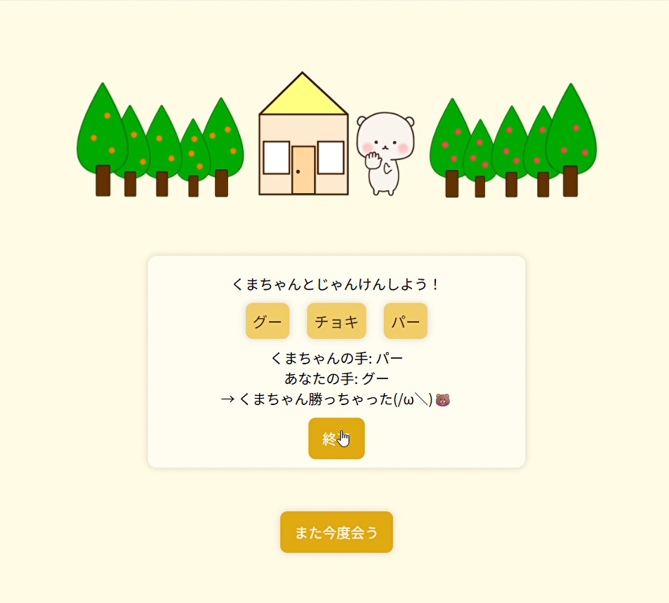
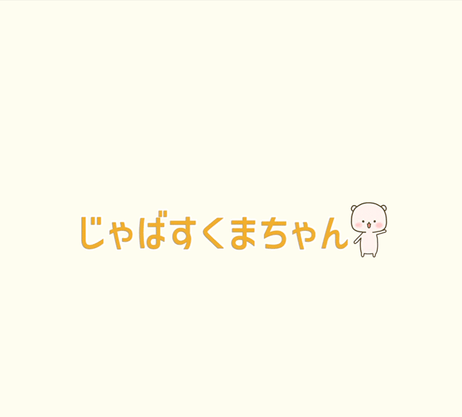

# 🐻 じゃばすくまちゃん

くまちゃんと一緒に遊べる、かわいくて楽しい **クイズ＆じゃんけんゲーム** のサイトです！  
パソコン・スマホのどちらからでも遊べます📱💻

---

 


---

## 🧩 内容紹介

「じゃばすくまちゃん」は、以下の3ステップで構成されています：

1. **クイズ1問目**
2. **クイズ2問目**
3. **くまちゃんとじゃんけん対決！**

各ステージでは、くまちゃんのリアクションがポップアップで表示され、楽しさ倍増！  
正解しても、不正解でも、くまちゃんは優しく応援してくれます🐻💬
クローンしてindex.htmlから遊んでください。

---

## 🛠️ 技術スタック（使用技術）

| 技術        | 内容                            |
|-------------|---------------------------------|
| HTML       | 基本構造                        |
| CSS        | レイアウト・アニメーション・ポップアップ |
| JavaScript  | クイズ判定・じゃんけんロジック・モーダル表示 |
| RESS        | リセットCSSライブラリ（CDN読み込み） |

---

## 📁 ディレクトリ構成

```plaintext
javaScuma/
├── index.html # メインページ
├── css/
│ └── style.css # スタイル定義
├── js/
│ ├── game.js # クイズ＆じゃんけんロジック
│ ├── loading.js # 読み込み演出
│ ├── popupbtn.js # ポップアップ演出
│ └── modal.js # モーダル表示
├── images/
│ ├── kuma1.png # くまちゃん画像など
│ ├── mori.png # 背景画像
│ └── ... # その他素材
└── README.md # このドキュメント
```
---

## 🌸素材

自作イラスト🐻

---

## 🥺 ライセンス

このアプリは個人の学習目的で作成されたものであり、**商用利用を禁止**しています。  
その他の利用条件については、[LICENSE](./LICENSE) ファイルをご確認ください。

---

